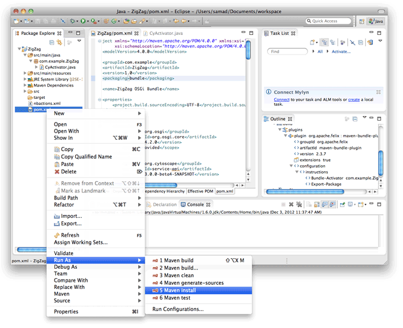

# Get Started with Eclipse

Set up Eclipse for Cytoscape 3.0 app development with this guide.
The version of Eclipse we will be using is Juno Service Release 1.

# Download and Install Eclipse

 1. Download _Eclipse IDE for Java Developers_ from <http://www.eclipse.org/downloads/>.

    

    

 1. Extract the downloaded archive.

    

    You should now have a folder with Eclipse:

    

# Start Eclipse

 1. Start the Eclipse application.

    

 1. If you get this dialog, just click _OK_.

    

 1. If you see this window, click the _Workbench_ icon.

    

    Now you should be seeing Eclipse's _Workbench_ window.

    

# Create an OSGi bundle project

Eclipse has _osgi-archetype_ project achetype for creating OSGi bundles. We will use this
archetype to create our project.

 1. In the menu bar, choose _File_ &rarr; _New_ &rarr; _Other..._.

 1. In the _New_ dialog, open the _Maven_ folder, then choose _Maven Project_. Click _Next_.

    

 1. In the _New Maven Project_ dialog, click _Next_.

    

 1. Enter `osgi` in the _Filter_ field. Then select _osgi-archetype_ in the _Artifact Id_ column.
    Click _Next_.

    

 1. Fill out some details about the project:
    - In the _Group Id_ field, enter `com.example`.
    - In _Artifact Id_, enter `ZigZag`.
    - In _Version_, enter `1.0`.

    Click _Finish_.

    

# Set up pom.xml for Cytoscape

When we create an _osgi-archetype_ project, it will use OSGi version 4.3.0. However, Cytoscape
uses version 4.2.0. We change the OSGi version to 4.2.0, so we can use our bundle in Cytoscape.

 1. In the _Package Explorer_ panel in the top-left area of the Workbench, open the
    _ZigZag_ project. Now open _pom.xml_.

 1. Choose the _Dependencies_ tab in the _ZigZag/pom.xml_ panel.

 1. Select the _org.osgi.core_ dependency, then click _Properties_.

  

 1. Enter `4.2.0` in the _Version_ field. Click _OK_.

  

Now we add dependencies to Cytoscape bundles that we need to create a proper app.

 1. In the _Dependencies_ paenl, click _Add_.

 1. In the _Select Dependency_ dialog:

   - Enter `org.cytoscape` in _Group Id_.
   - Enter `service-api` in _Artifact Id_.
   - Enter `3.0.0-beta4-SNAPSHOT` in _Version_.

    Click _OK_.

  

 1. Repeat the above steps, but with these artifact IDs. The group ID and version stay the same.

   - `swing-application-api`
   - `work-api`
   - `core-task-api`

Save _pom.xml_.

# Set up CyActivator

CyActivator is a class that Cytoscape calls to start our app. Here we create a CyActivator class by
modifying the Activator class created by osgi-archetype.

 1. Open _src/main/java_, then _com.example.ZigZag_. Right click on _Activator.java_ and choose
    _Refactor_ &rarr; _Rename_.

 1. Enter `CyActivator` in the _New name_ field. Click _Finish_.

 1. Open _CyActivator.java_. Make the following changes:

  - Remove the _stop_ method.

  - Add `import org.cytoscape.service.util.AbstractCyActivator;` to the list of import statements.

  - Change _CyActivator_ so that it `extends AbstractCyActivator`.

  - Remove the import statement for `BundleActivator`.

  - Add something to the _start_ method like `System.out.println("Hello from ZigZag!");`.

  Save _CyActivator.java_.

  

osgi-archetype created a pom.xml file that refers to Activator.java. Because we renamed it,
we tell pom.xml that we want to use CyActivator instead.

 1. Go back to the _pom.xml_ file and select the _pom.xml_ tab.

 1. Look for the _Bundle-Activator_ tag. Change its value to `com.example.ZigZag.CyActivator`.
    - One way to find this tag is with the _Outline_ panel on the right. Open
      _project_ &rarr; _build_ &rarr; _plugins_ &rarr; _plugin org.apache.felix : maven-bundle-plugin_
      &rarr; _configuration_ &rarr; _instructions_ &rarr; _Bundle-Activator_.

    

# Building and running your app

 1. Right click on _pom.xml_, then choose _Run As_ &rarr; _Maven install_.

    

 1. When your app has been built, open up Cytoscape. Once Cytoscape has finished starting up,
    copy your app's jar to the  _CytoscapeConfiguration_ > _3_ > _apps_ > _installed_ folder.
    _CytoscapeConfiguration_ is located in your home folder.

 1. Now that your app jar has been copied, Cytoscape will pick up the jar and load it. You do
    not have to restart Cytoscape when you make changes to your app and put in a new jar.
